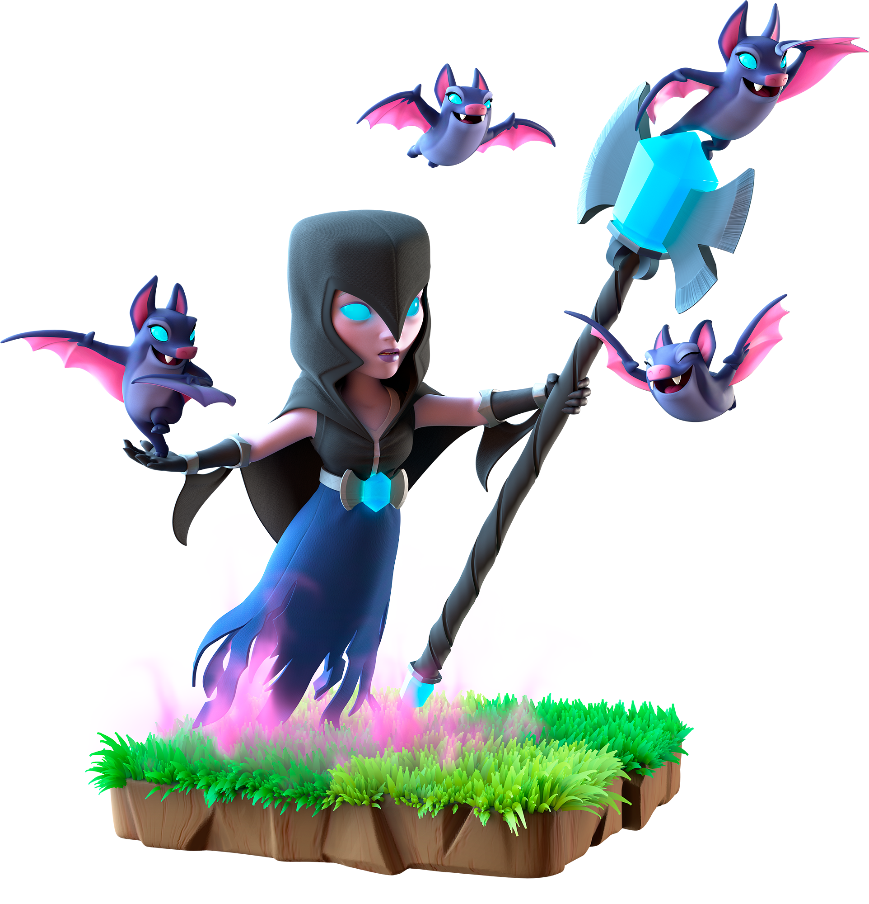

<h1 align="left">Tech Stack 📟</h1>
<table align="left">
  <tr>
    <td align="center" width="96">
        
       React
    </td>
    <td align="center" width="96">
      
       Python
    </td>
    <td align="center" width="96">
        
       JavaScript
    </td>
     <td align="center" width="96">
        
       Nodejs
      </td>
  </tr>
  <tr>
    <td align="center"  width="96">
        
       HTML5
    </td>
    <td align="center"  width="96">
        
       TypeScript
    </td>
    <td align="center" width="96">
        
       Tailwind
    </td>
     <td align="center" width="96">
        
       CSS
    </td>
    </tr>
 <tr>
      <td align="center" width="96">
        
       MongoDB
    </td>
    
<td align="center" width="96">
        
       MySQL
    </td>
            <td align="center" width="96">
        
       Fast API
    </td>
    <td align="center" width="96">
        
       Figma
    </td>
 </tr>
  <tr>
      <td align="center" width="96">
        
       Auth
    </td>
    
<td align="center" width="96">
        
       Express
    </td>
            <td align="center" width="96">
        
       Native
    </td>
    <td align="center" width="96">
        
       Prisma
    </td>
 </tr>
</table>

   

     
      
   > **_"With great power, comes great responsibility." ~ Ben Parker_**  
   
<h3 align="center">Socials 📌</h3>
<table align="center">
  <tr>
    <td align="center" width="70">
        
        Linkedin
    </td>
      <td align="center" width="70">
      
       Codeforces
    </td>
    <td align="center" width="70">
        
        Leetcode
    </td>
     <td align="center" width="70">
      
         Youtube
    </td>
     <td align="center" width="70">
        
          Gmail
      </td>
     
  </tr>

</table> 

 

---

###

<h1> 📊 GitHub Stats</h1>

|  |  |  |
|:-:|:-:|:-:|

|  |  |
|:-:|:-:|

---
# 🎖️ Holopins Badges 🏆

<!-- 
 -->
   <!--  -->
  <!--  -->
<!-- 
 -->

<!-- 

   

  
  
    
  
   
 -->

        <!--     -->
      <!--  -->
           

  
  <!--  -->
  
  

  <!--  -->
  <!--  -->
   

<!-- 

 -->
